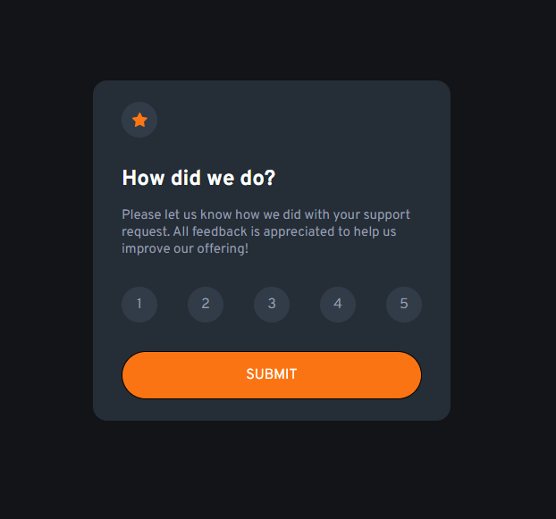
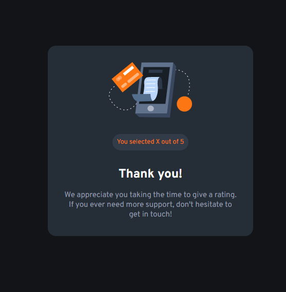

# Frontend Mentor - Interactive rating component solution

Essa é a solução de [Interactive rating component challenge on Frontend Mentor](https://www.frontendmentor.io/challenges/interactive-rating-component-koxpeBUmI). 

## Tabela de Conteúdo

- [Visão geral](#overview)
  - [O desafio](#the-challenge)
  - [Screenshot](#screenshot)
  - [Links](#links)
- [Minha trajetória](#my-process)
  - [Contruído com...](#built-with)
  - [O que eu aprendi](#what-i-learned)
  - [Desenvolvimento continuado](#continued-development)
  - [Fontes úteis](#useful-resources)
- [Sobre o autor](#author)
- [Reconhecimentos](#acknowledgments)

## Visão geral

### O desafio

Os usuários devem ser capazes de:

- Ver o layout ideal para o aplicativo, independente do tamanho da tela do dispositivo
- Ver os estados de foco para todos os elementos interativos na página
- Selecionar e enviar uma classificação numérica
- Ver o estado do cartão "Obrigado" após enviar uma avaliação

### Screenshot

### Links

- Solution URL: [Add solution URL here](https://your-solution-url.com)
- Live Site URL: [Add live site URL here](https://your-live-site-url.com)

## Meu progresso

### Construído com...

- HTML5
- CSS3 e suas propriedades
- Flexbox
- Mobile-first
- Manipulação de DOM em Javacript

### O que eu aprendi

Eu adquiri conhecimentos práticos acerca da manipulação de informações no DOM e percebi, por meio de uma tentativa mal sucedida de utilização de um valor armazenado em uma página em outra, a importância de definir corretamente as variáveis utilizadas no projeto. Dessa forma, é necessário que eu conclua o projeto e determine, na página de agradecimento, a nota de avaliação atribuída pelo usuário.

## Autor

- LinkedIn - [Philipe Rodrigues](https://www.linkedin.com/in/philipe-rodrigues-3b3884226/)

## Reconhecimentos

O projeto ainda não foi finalizado...